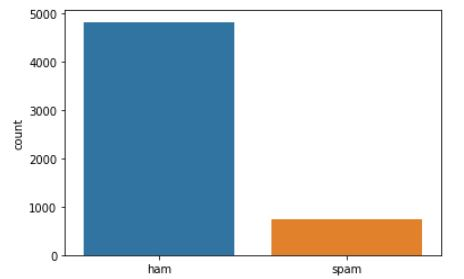
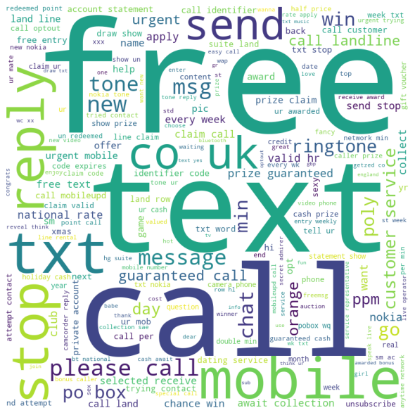
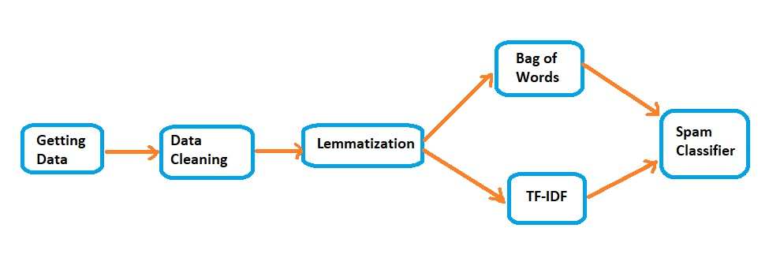
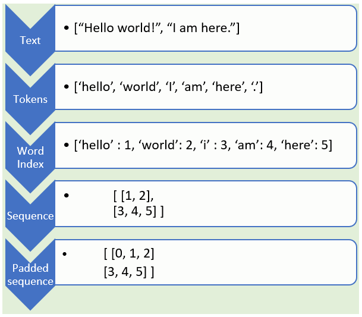
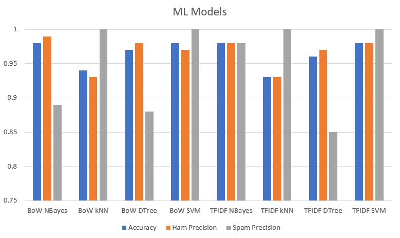
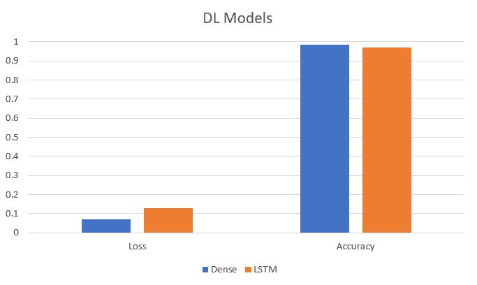

# Spam Classifier

Overview
-

We will build a binary classification model to detect whether a text message is spam or not (aka Ham). We used Machine Learning and Deep Learning techniques for the same.

Steps Involved
-

- Understanding Data
- Lemmatization
- Classification using Bag of Words technique
- Classification using TFIDF technique
- Machine Learning models using Naive Bayes, KNeighborsClassifier, DecisionTreeClassifier, SVM Classifier
- Word Clouds for Spam and Ham
- Deep Learning techniques using Dense network and LSTM

Working Structure
-

Initially here's the Ham vs Spam distribution among the messages:

We can also check out the Word Cloud for spam and ham. Here's the one for spam:

**Machine Learning structure:**

Spam classifier is the ML model classifier (one among Naive Bayes, KNN, Decision Tree, SVM).

**Deep Learning structure:**

Padded sequence is then passed through either the Dense network or LSTM network.

Output
-

Among ML models, SVM Classifier using TFIDF gave best result in terms of precision, accuracy and f1-score. Among DL models, Dense network performed better in terms of validation loss and accuracy. So used both for model building.

